# Zipsoon (집순)
> 집 순위를 손쉽게 매겨봅시다! 집순

Zipsoon은 사용자 설정에 따라 부동산 매물에 점수를 보여주는, 집 구하기 서비스입니다.

<br><br>

## 0. 빠르게 구경하세요!


⚠️테스트 데이터는 `서울특별시 종로구`만을 포함합니다. 지도를 위쪽으로 움직여 주세요!

- [↗️ zipsoon-visualizer 웹앱 구경하기](https://zipsoon-visualizer.onrender.com/)
- [↗️ swagger 구경하기](https://zipsoon-api.onrender.com/swagger-ui/index.html)

<br><br>

## 1. 최초 기획 화면

<table>
  <tr>
    <th>메인 화면</th>
    <th>매물 검색 결과</th>
    <th>매물 상세 정보</th>
    <th>사용자 설정</th>
  </tr>
  <tr valign="top">
    <td>
      <br>
      • 게스트: 매물 정보만 제공
    </td>
    <td>
      <br>
      • 사용자: 매물 점수 제공<br>
      > 매물의 종합 점수와, 상위 3개 상세 점수를 제공<br>
      > 각 상세 점수는 고유한 점수 계산 방식을 따름
    </td>
    <td>
      <br>
      • 매물 선택: 종합 평점, 상세 정보 제공<br>
      > 매물의 상세 정보와, 모든 상세 점수를 제공
      > 마음에 드는 매물을 찜할 수 있음
    </td>
    <td>
      <br>
      • 사용자 설정: 상세 점수 개인화<br>
      > 사용자는 특정 점수 계산 방식을 포함/제외시킬 수 있음
    </td>
  </tr>
</table>


<br><br>

## 2. 아키텍처 및 ERD
### 프로젝트 구조
```
.
├── 📁 api                  : SpringBoot REST API 어플리케이션입니다. 클라이언트와 통신을 담당합니다.
├── 📁 batch                : SpringBatch 어플리케이션입니다. 각종 정보를 수집, 계산하고 DB에 저장합니다.
├── 📁 common               : 공통 모듈입니다.
├── 📁 zipsoon-visualizer   : 디버깅용 Vanilla JS 프론트엔드 웹앱입니다.
├── Makefile                : 손쉬운 로컬 실행을 돕는 Makefile입니다.
└── zipsoon_dump.sql        : 테스트 데이터를 포함한 sql입니다.
```
### 아키텍처

```mermaid
flowchart LR
    subgraph TOP[" "]
        direction LR

        subgraph BATCH["SpringBatch"]
            direction TB
            SourceJob["1\. SourceJob<br>(필요 데이터 수집)"]
            EstateJob["2\. EstateJob<br>(부동산 매물 정보 수집)"]
            ScoreJob["3\. ScoreJob<br>(부동산 매물별 점수 계산)"]
            NormalizeJob["4\. NormalizeJob<br>(0-10점으로 정규화)"]
            
            SourceJob --> EstateJob
            EstateJob --> ScoreJob
            ScoreJob --> NormalizeJob
        end

        subgraph MIDDLE[" "]
            style MIDDLE stroke-width:0px
            direction TB
            subgraph SOURCE["외부 자원"]
                direction LR
                NaverLand["네이버 부동산<br>(웹 자원)"]
                PublicData["외부 데이터 정보<br>*행정구역코드, 공원 정보 등<br>(csv 파일)"]
                NaverLand ~~~ PublicData
            end


            subgraph DB["핵심 DB(PostgreSQL)"]
                EstateTable[(estate)]
                EstateScoreTable[(estate_score)]
                AppUserTable[(app_user)]
            end

            
            SOURCE ~~~ DB

        end


        subgraph API["SpringBoot"]
            direction TB
            ViewportSearch["지도 뷰포트 검색<br>.../estates/map"]
            DetailView["매물 상세 조회<br>.../estates/{id}"]
            ScoreFilter["점수 타입 활성화/비활성화<br>.../estates/score-types"]
            Favorite["매물 찜하기<br>.../estates/{id}/favorite"]

            ViewportSearch ~~~ DetailView
            DetailView ~~~ ScoreFilter
            ScoreFilter ~~~ Favorite
        end

        BATCH["SpringBatch"] <-.-> MIDDLE <-.-> API["SpringBoot"]
    end
```

### ERD
<br>

<br><br>

## 3. 챌린지

<br><br>

## 4. 직접 실행

### Codespace로 실행
- Codespace로 프로젝트를 손쉽게 확인하세요. 다운로드, 환경 세팅의 번거로움이 없습니다. 딱 1분 소요됩니다!
- [초대 링크](https://codespaces.new/f-lab-edu/zipsoon?quickstart=1)를 누르시고, 다음 가이드를 따라 주세요.
<br>

<br><br>

### 로컬 실행

Windows
```
git clone https://github.com/f-lab-edu/zipsoon
cd zipsoon
move .env.example .env
make db
gradlew.bat :api:bootRun --args="--spring.profiles.active=local"
```
macOS
```
git clone https://github.com/f-lab-edu/zipsoon
cd zipsoon
mv .env.example .env
make db
./gradlew :api:bootRun --args="--spring.profiles.active=local"
```
- 도커가 사전에 설치되어 있어야 합니다.
- 위 방법은 테스트 데이터가 포함된 db 컨테이너를 생성합니다.

<br><br>

### ⚠️ 로컬 실행 (테스트 데이터 없이 batch 실행하기)
- ___batch 어플리케이션의 직접 실행은 보안상의 문제로 권장되지 않습니다.___
- 꼭 실행이 필요하다면 다음을 따라 주세요.

Windows
```
git clone https://github.com/f-lab-edu/zipsoon
cd zipsoon
move .env.example .env
make emptydb
```
macOS
```
git clone https://github.com/f-lab-edu/zipsoon
cd zipsoon
mv .env.example .env
make emptydb
```
이후
1. `.env`파일의 `NAVER_LAND_AUTH_TOKEN`에 네이버 로그인 시 발급받은 JWT 토큰을 입력
2. `local profile`로 batch->api 순서로 실행
