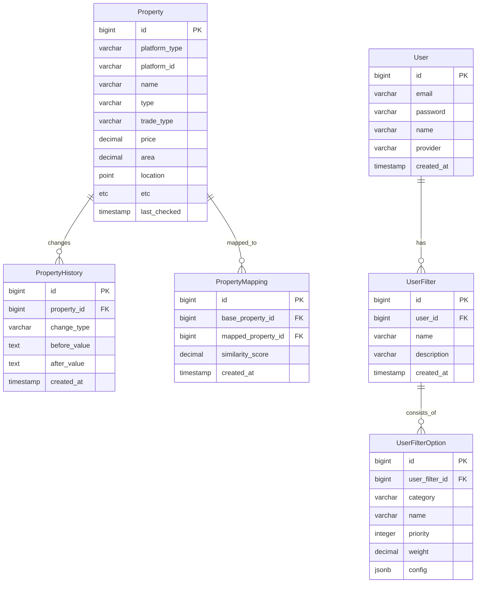

# Zipsoon (집순)
맞춤형 주거지 추천 서비스

## 1. 프로젝트 소개

Zipsoon은 사용자가 설정한 필터에 따라 부동산 매물 점수를 매겨주는 "집 구하기" 서비스입니다.

## 2. Features & Screens

<table>
  <tr>
    <th style="width: 50%; text-align: center;">메인 화면</th>
    <th style="width: 50%; text-align: center;">매물 검색 결과</th>
  </tr>
  <tr>
    <td style="text-align: center;">
      
      <br>
      • <i>인기 매물</i> 순위별 노출<br>
      • 게스트용 필터로 매물 점수 계산<br>
      • 매물 가격 노출
    </td>
    <td style="text-align: center;">
      
      <br>
      • <i>사용자 지정 매물</i> 순위별 노출<br>
      • 사용자가 설정한 필터로 매물 점수 계산<br>
      • 매물 가격, 상위 3개필터 노출
    </td>
  </tr>
  <tr>
    <th style="text-align: center;">매물 상세 정보</th>
    <th style="text-align: center;">사용자 설정</th>
  </tr>
  <tr>
    <td style="text-align: center;">
      
      <br>
      • 매물 종합 평점과 세부 정보 제공<br>
      • 사용자가 선택한 필터별 점수 노출
    </td>
    <td style="text-align: center;">
      
      <br>
      • 사전 제공되는 필터 제공<br>
      • 필터 추가, 제거, 순위 변경 기능 제공
    </td>
  </tr>
</table>


## 3. Tech Stack

**Core**
- Java 17
- Spring Boot 3.2.x
- Spring Security with JWT Authentication
- MyBatis

**Database**
- PostgreSQL 15 with PostGIS extension
- Supabase

**Testing**
- JUnit 5
- Testcontainers for integration testing
- Mockito for unit testing

**Build & Development**
- Gradle 8.x
- Docker
- Docker Compose

**API Documentation**
- Swagger/OpenAPI

## 4. System Architecture


## 5. ERD


## 6. API 명세

### Properties
```http
GET /api/v1/properties
    ?bounds=nw_lat,nw_lng,se_lat,se_lng
    &filters={"transport":{"stations":["강남역"],"maxMinutes":30}}
    &page=0 ⚠️변경가능
    &size=20 ⚠️변경가능

GET /api/v1/properties/{id}

GET /api/v1/properties/search
    ?keyword=강남역
    &filters=
    &page=0 ⚠️변경가능
    &size=20 ⚠️변경가능
```

### User Preferences 
```http
POST /api/v1/users/preferences
GET /api/v1/users/preferences
PUT /api/v1/users/preferences/{id}
```

### Facilities
```http
GET /api/v1/facilities
    ?type=HOSPITAL
    &bounds=nw_lat,nw_lng,se_lat,se_lng
```

### Filter Set 관리
```http
POST /api/v1/users/filter-sets
GET /api/v1/users/filter-sets
GET /api/v1/users/filter-sets/{id}
PUT /api/v1/users/filter-sets/{id}
DELETE /api/v1/users/filter-sets/{id}
```

### Filter Set 내 필터 관리
```http
POST /api/v1/users/filter-sets/{setId}/filters
GET /api/v1/users/filter-sets/{setId}/filters
PUT /api/v1/users/filter-sets/{setId}/filters/{filterId}
DELETE /api/v1/users/filter-sets/{setId}/filters/{filterId}
PATCH /api/v1/users/filter-sets/{setId}/filters/reorder
```

### Authentication
```http
POST /api/v1/auth/signup
POST /api/v1/auth/login
POST /api/v1/auth/oauth/{provider}
POST /api/v1/auth/refresh
DELETE /api/v1/auth/logout
```


## 7. Technical Challenge

### i) 실시간 매물 정보 관리
- 네이버 부동산 매물 데이터 크롤링 및 동기화
- 지역별 매물 정보 업데이트 관리

### ii) 맞춤형 필터 시스템
- 매물 점수 계산 시스템
- 옵션에 따른 매물 필터링

### iii) 추천 시스템
- (TBD) 사용자의 성별, 나이, 지역에 따른 추천 시스템

### iv) 성능 최적화
- (TBD)
